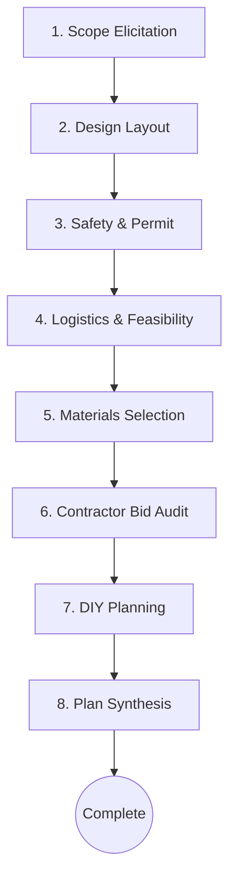

# Reno Compass — Intelligent Bathroom Remodel Coordinator

Reno Compass is an agentic renovation planning and safety-verification assistant. It coordinates bathroom remodeling workflows across 8 structured stages—from initial scope elicitation to final blueprint synthesis—by executing a Directed Acyclic Graph (DAG) state machine. 

The system leverages the native Google Vertex AI SDK for safety-firewalled AI planning and Google Cloud Storage (GCS) for transaction checkpoints, integrated alongside deterministic calculators (geometry, lighting targets, and structural/electrical envelopes).

---

## 1. System Architecture & Design



### Core Pipeline Loop Controls
*   **T1a (Budget Reality check)**: Block progression if stated budget is unrealistic compared to ballpark estimates.
*   **E1 / E2 (Design Revisit & Cascade)**: Revoke confirmations and reset downstream outputs when modifying layouts or dimensions. Capped at 4 design passes.
*   **T10 (Envelope Breach)**: Exceeding floor weight or electrical loads reopens Safety classification gates.
*   **T5a (Displacement Loop)**: Determines lodging/relocation outlays if utilities (water, power, sewer) go offline beyond tolerable limits.
*   **OM-5 (DIY Conditional Gate)**: Skips the DIY planning stage if the project is all-professional work.

---

## 2. Operations & Usage Guide

### Prerequisites
*   Python 3.12+
*   Google Cloud Platform (GCP) credentials for Vertex AI and GCS storage.

### Local Installation
Install the project packages and testing dependencies:
```bash
pip install -r requirements.txt
```

### Running the Verification Suites
Reno Compass utilizes Gherkin BDD integration tests and pytest unit tests for validation.

```bash
# Run Gherkin BDD Integration scenarios
behave tests/features/

# Run unit and endpoint integration tests
PYTHONPATH=. pytest tests/
```

### Initializing GCS Infrastructure
To create the session state storage bucket on Google Cloud:
```bash
python scripts/setup_gcs.py
```

### Starting the Server
Run the FastAPI backend locally:
```bash
uvicorn src.main:app --host 0.0.0.0 --port 8000
```
Open your browser and head to `http://localhost:8000` to interact with the single-page application.

### Containerized Deployment
A container stack is pre-configured with hot-reloading for local staging. To spin it up:
```bash
docker compose up --build
```

---

## 3. Implementation Plan Summary

### Phase 1: Foundation & Domain Layer
*   **Configuration Schema**: Set up config loaders for Vertex AI and GCS bucket targets. Enforces 72-hour sliding and 30-day absolute session TTLs.
*   **Dossier Contract**: Pydantic models mapping domain structures. Includes a semantic-version checking utility.
*   **Session Storage**: Implemented atomic checkpoint operations using GCS. Features local folder fallbacks for offline development.

### Phase 2: Deterministic Calculators
*   **Measurement Math**: Wall/floor area and volume checking. Automatically raises custom errors on dimensions matching TS-38 ($\ge 40\text{ ft}$).
*   **Allergy Screening**: 3-state allergen validator (confirmed clear, conflict flagged, or skipped).
*   **Envelope Validator**: Evaluates joist cuts, heavy slab structural spans, and panel amp boundaries against NEC/IRC rules.
*   **Document Generators**: Base64 exporters rendering blueprints in PDF (embedding structured `dossier.json`) and material estimates in Excel. Carry warning disclaimers stating: *"Confidential: Educational planning artifact only. Not intended for contractor distribution."*

### Phase 3: Orchestration & BDD Integration
*   **DAG State Machine**: Traversal rules and E1..E4 cascade reset sequences.
*   **BDD Step Runners**: Integration testing suite matching Gherkin specs via `behave`.

### Phase 4: Stage Agents & Safety Firewall
*   **Vertex AI Client**: Base client with system prompt hydration ( constitution, behavior invariants, reasoning skill manuals, and code reference databases ).
*   **Wrong Tool Recovery**: Automatic auto-retries on model exceptions with exponential backoff.
*   **Dynamic Scopes**: Filters active dossier context to authorized `reads` and `writes` boundaries (Principle 8).
*   **Search Grounding**: Vertex grounding configuration to search Google for unvalidated materials.

### Phase 5: FastAPI Web API & Dark Glassmorphic SPA
*   **Telemetry Logs**: Middleware injecting Correlation IDs and logging transactions in JSON (omitting sensitive customer details).
*   **Rate Limits**: Endpoint limiter capping requests at 1 chat request per minute.
*   **Frontend UI**: Responsive, premium dark violet design theme providing real-time pipeline visual updates, state explorer drawers, and PDF-restore uploaders.
