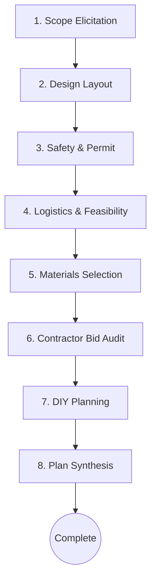
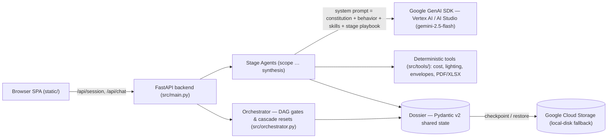

# Reno Compass — Intelligent Bathroom Remodel Coordinator

## The Problem

A bathroom remodel is one of the most common home projects — and one of the easiest to get wrong. Homeowners plan them with almost no visibility into the things that actually cause trouble: which work legally needs a **licensed professional or a permit**, whether a heavy tub or a moved wall crosses a **structural or electrical** line, what the job will **realistically cost in their ZIP code** (versus the number they hoped for), whether a **contractor's quote quietly omits** half the scope, and which tasks are genuinely **safe to DIY**. The result is budget blowups, failed inspections, unsafe shortcuts, and decisions made without informed consent. Generic chatbots make it worse — they will happily hand out step-by-step instructions for work that should never be attempted without a professional.

## The Solution

Reno Compass is an agentic renovation planning and safety-verification assistant. It coordinates bathroom remodeling workflows across 8 structured stages—from initial scope elicitation to final blueprint synthesis—by executing a Directed Acyclic Graph (DAG) state machine. Every stage is a safety-firewalled AI agent backed by deterministic calculators, so the guidance is calibrated, sourced, and honest about what needs a pro — never a generic chatbot guess.

The system leverages the unified Google GenAI SDK — running against **Google Vertex AI** or **Google AI Studio** (via an API key) — for safety-firewalled AI planning, and Google Cloud Storage (GCS) for transaction checkpoints, integrated alongside deterministic calculators (geometry, lighting targets, and structural/electrical envelopes). Each stage agent's system prompt is composed at runtime from the safety constitution, the always-on behavior rules, its own reasoning-skill manuals and reference tables, and **only its own stage's workflow playbook** — which keeps every agent strictly within its lane.

> Scope note: Reno Compass currently plans **bathroom remodels only** (its safety and cost guidance is bathroom-specific); the agent politely declines out-of-scope project types.

---

## 1. System Architecture & Design



### Component Architecture



The browser SPA talks to a FastAPI backend, which hands each turn to the orchestrator (DAG gating) and the active stage agent. Agents reason via the Google GenAI SDK but delegate all arithmetic to deterministic Python tools; the shared Pydantic **dossier** is the single source of truth, checkpointed to GCS between turns.

### Technology Stack
*   **Backend:** Python 3.12+, FastAPI (`src/main.py`) fronting a DAG orchestrator (`src/orchestrator.py`).
*   **Agents:** eight stage agents on the unified Google GenAI SDK (Vertex AI or AI Studio, `gemini-2.5-flash`), each firewalled by the safety constitution.
*   **State:** a single Pydantic v2 dossier passed between stages; checkpointed to Google Cloud Storage with a local-disk fallback for offline development.
*   **Deterministic tools (`src/tools/`):** cost ballparks, IES lighting targets, structural/electrical envelopes, and PDF/XLSX deliverables — math never touches the LLM.
*   **Frontend:** a dependency-free vanilla-JS single-page app in `static/`.
*   **Testing:** pytest (unit + integration) and behave (Gherkin BDD).

### Core Pipeline Loop Controls
*   **T1a (Budget Reality check)**: Block progression if stated budget is unrealistic compared to ballpark estimates.
*   **E1 / E2 (Design Revisit & Cascade)**: Revoke confirmations and reset downstream outputs when modifying layouts or dimensions. Capped at 4 design passes.
*   **T10 (Envelope Breach)**: Exceeding floor weight or electrical loads reopens Safety classification gates.
*   **T5a (Displacement Loop)**: Determines lodging/relocation outlays if utilities (water, power, sewer) go offline beyond tolerable limits.
*   **OM-5 (DIY Conditional Gate)**: Skips the DIY planning stage if the project is all-professional work.

---

## 2. Operations & Usage Guide

### Prerequisites
*   Python 3.12+
*   Credentials for a live run (resolved in this order): `GEMINI_API_KEY` (Google AI Studio — overrides everything) → Application Default Credentials (`gcloud auth application-default login`) → a service-account JSON in `GOOGLE_APPLICATION_CREDENTIALS_JSON`. `GCP_PROJECT_ID` and `VERTEX_LOCATION` are auto-discovered if unset.
*   No credentials needed for offline development — set `MOCK_VERTEX_AI=true STORAGE_LOCAL_FALLBACK=true` to run without live LLM calls or GCS.

> Import convention: `src/` is **not** a package — modules import each other as top-level names, so `src` must be on `PYTHONPATH`. This is why the commands below use `PYTHONPATH=src` rather than a `src.`-prefixed import path.

### Local Installation
Install the project packages:
```bash
pip install -r requirements.txt
```

### Running the Verification Suites
Reno Compass uses pytest unit/integration tests and Gherkin BDD scenarios. `pytest.ini` already sets `pythonpath=src` and `testpaths=tests`, so no path flags are needed:

```bash
# Unit + integration tests (offline — no live LLM/GCS)
MOCK_VERTEX_AI=true STORAGE_LOCAL_FALLBACK=true pytest

# Gherkin BDD integration scenarios
behave tests/features/
```

Tests under `tests/evals/` make real model calls (they run with `MOCK_VERTEX_AI=false`) and require live credentials — run them selectively.

### Initializing GCS Infrastructure
`scripts/setup_gcs.py` creates the session-state checkpoint bucket, so it needs the Google Cloud CLI installed and an authenticated session with a project set first.

**Prerequisite — install & authenticate the gcloud CLI:**
```bash
gcloud init                                   # install + initialize the Cloud CLI
gcloud auth application-default login         # Application Default Credentials
gcloud config set project <GCP_PROJECT_ID>    # or export GCP_PROJECT_ID
```
(This is the ADC step in the `GEMINI_API_KEY` → ADC → service-account JSON auth order from **Prerequisites** above; the project/location are otherwise auto-discovered.)

Then create the bucket:
```bash
python scripts/setup_gcs.py
```

### Starting the Server
Run the FastAPI backend locally (note `PYTHONPATH=src` and the `main:app` target — `src.main:app` will **not** work, see the import convention above):
```bash
PYTHONPATH=src uvicorn main:app --host 0.0.0.0 --port 8000
```
Open your browser at `http://localhost:8000` to interact with the single-page application.

### Containerized Deployment
A container stack is pre-configured for local staging. To spin it up:
```bash
docker compose up --build
```
The container publishes on **port 8000** — open `http://localhost:8000`.

---

## 3. Implementation Plan Summary

### Phase 1: Foundation & Domain Layer
*   **Configuration Schema**: Set up config loaders for Vertex AI and GCS bucket targets. Enforces 72-hour sliding and 30-day absolute session TTLs.
*   **Dossier Contract**: Pydantic models mapping domain structures. Includes a semantic-version checking utility.
*   **Session Storage**: Implemented atomic checkpoint operations using GCS. Features local folder fallbacks for offline development.

### Phase 2: Deterministic Calculators
*   **Measurement Math**: Wall/floor area and volume checking. Automatically raises custom errors on dimensions matching TS-38 ($\ge 40\text{ ft}$).
*   **Allergy Screening**: 3-state allergen validator (confirmed clear, conflict flagged, or skipped).
*   **Envelope Validator**: Evaluates joist cuts, heavy slab structural spans, and panel amp boundaries against NEC/IRC rules.
*   **Document Generators**: Base64 exporters rendering blueprints in PDF (embedding structured `dossier.json`) and material estimates in Excel. Carry warning disclaimers stating: *"Confidential: Educational planning artifact only. Not intended for contractor distribution."*

### Phase 3: Orchestration & BDD Integration
*   **DAG State Machine**: Traversal rules and E1..E4 cascade reset sequences.
*   **BDD Step Runners**: Integration testing suite matching Gherkin specs via `behave`.

### Phase 4: Stage Agents & Safety Firewall
*   **Model Client**: Unified GenAI client (Vertex AI or AI Studio) with system-prompt hydration — safety constitution, behavior invariants, the agent's reasoning-skill manuals and code-reference databases, and its own stage workflow playbook.
*   **Wrong Tool Recovery**: Automatic auto-retries on model exceptions with exponential backoff.
*   **Dynamic Scopes**: Filters active dossier context to authorized `reads` and `writes` boundaries (Principle 8).
*   **Search Grounding**: Vertex grounding configuration to search Google for unvalidated materials.

### Phase 5: FastAPI Web API & Dark Glassmorphic SPA
*   **Telemetry Logs**: Middleware injecting Correlation IDs and logging transactions in JSON (omitting sensitive customer details).
*   **Rate Limits**: Per-token endpoint limiter (default 10 requests/minute with a burst of 5; configurable via `RATE_LIMIT_PER_MINUTE` / `RATE_LIMIT_BURST`).
*   **Frontend UI**: Responsive, premium dark violet design theme providing real-time pipeline visual updates, state explorer drawers, and PDF-restore uploaders.

---

## 4. Roadmap — Planned Future Features

These are deliberately staged enhancements, not gaps: the priority was proving the agentic architecture and the safety spine first, then broadening. Each item is a considered sequencing decision.

- **All home renovation projects** — Reno Compass plans **bathroom remodels only** today; the headline direction is extending the same guided, safety-first pipeline across every home renovation project — kitchens, additions, basements, whole-home.
- **Multi-domain expansion (the how)** — The pipeline, tier-classification, retention model, and dossier are already domain-agnostic; each new domain needs its own curated, frozen safety matrix (new hazards: gas ranges, high-draw appliance circuits, larger spans), added in lockstep with the data — never ahead of it.
- **Accounts & identity** — Session recovery today rests on an anonymous token plus portable PDF export; account-based persistence would turn "mostly recoverable" into "always recoverable" and unlock per-user history.
- **Community reference loop** — An append-only, human-reviewed "suggested-items" store that turns each web-search fallback into a candidate for the curated, frozen knowledge base — growing a validated reference set from real usage.
- **Live, local pricing** — Cost and rule references are curated and frozen today; county-level live pricing is planned, always surfaced as ranges with a verify-locally disclaimer.
- **Multi-jurisdiction code lookup** — Coverage centers on a single code framework with explicit local-verification flagging; multi-jurisdiction lookup demands precision work before it can be trusted in a safety domain.
- **Richer input & output** — Image/vision input (photograph the space instead of measuring) and to-scale design drawings (labeled schematics today).
- **Export privacy controls** — A redaction option for exported files, as a companion to the accounts-era privacy work.
